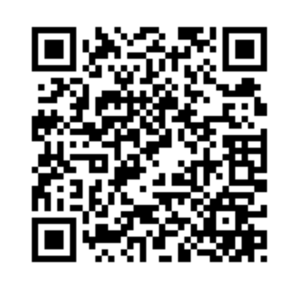
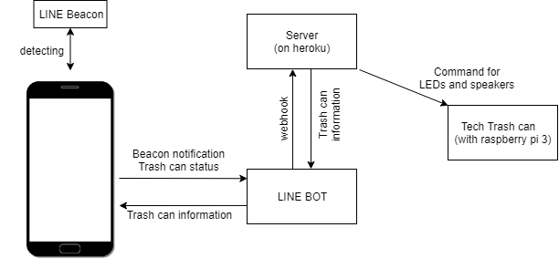
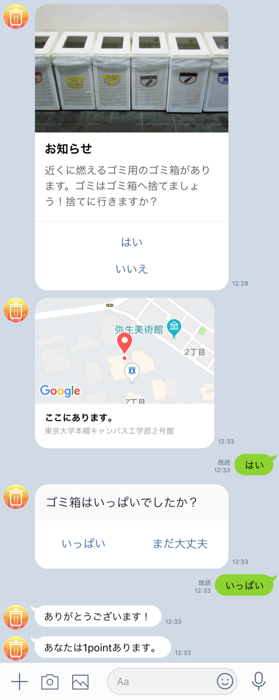

# ごみUp

## 製品概要
### ごみ×Tech

### 背景（製品開発のきっかけ、課題等）
日本では、海外に比べてゴミ箱が少なく、ゴミが捨てずらいという問題があります。一方で、東京のポイ捨て事情も深刻です。さらに、東京五輪を控えており、観光客の増加が見込まれるため、これらの問題は深刻さを増すことが予想されます。
そこで、ごみUpはゴミ箱を見つけるまでの工程をHackすることで、ゴミの捨てずらさの軽減とゴミを捨てることの楽しさを向上させます。

### 製品説明（具体的な製品の説明）

ごみUpはゴミ箱に近づくとLINE BOTを通じて、そのことを知らせてくれます。

    

ゴミ箱にはLINE Beaconが設置されており、簡単なIoTデバイスも設置することができます。例えば、ゴミ箱にLEDを設置しておけば、ユーザが近づいたときにLEDを明滅させて、その位置をわかり安く示してくれます。

ゴミをゴミ箱に捨て、その写真をLINE BOTに送ることや、ゴミ箱がいっぱいになったことをLINE BOTを通じて知らせることで、ユーザにポイントが付与されます。ポイントの高いユーザは、ゴミ箱から大きな歓迎を受けるでしょう。

ごみUpはこれらの機能を通じて、ゴミの位置をわかりやすくしてくれるだけでなく、ゴミを捨てることを楽しく演出したり、ゴミ箱が満杯になったことをゴミ箱の管理者に知らせることができるので、ゴミを捨てやすくしてくれるだけでなく、環境保全・景観美化にも貢献します。

 

### 特長
#### 1. ゴミ箱の少ない日本において、外出時にゴミを持ち歩く時間を少なくできる
#### 2. 日本の環境を美化する

### 解決出来ること
#### 1. ゴミを捨てたいのにゴミ箱が見つからなくて捨てられない人の不満
#### 2. ポイ捨て問題

### 今後の展望
- LINE BOT上でアプリを実装したことによって、他のアプリケーションとのシナジーが生まれるのではないか？（例：観光名所を紹介する）
- ゴミをより捨てたくなるような魅力的なゴミ箱を作ること（例：ゴミ箱が「お前の本気を見せてみろよ！」とゴミを捨てるようにあおってくる」）
- 正確なポイント付与をするために、ゴミを捨てたことをセンサーにより検出する

## 開発内容・開発技術
### 活用した技術
#### API・データ
* LINE BOT
* LINE Beacon
* NEC 簡単画像認識API

#### フレームワーク・ライブラリ・モジュール
* NODE.js
* Python
* LINE BOT
* heroku
* now
* Google Map API

#### デバイス
* raspberry pi3
* LINE Beacon
* スマートフォン

### 研究内容・事前開発プロダクト（任意）
なし

### 独自開発技術（Hack Dayで開発したもの）
#### 2日間に開発した独自の機能・技術
アイデアからすべてこの2日間で実装しました。

**特に力を入れた部分**
- LINE Beaconを使って位置情報を取得する
- LINE BOTのインタフェースを使った
- LINEの規約を遵守した
 - 当初想定していたアイデアは規約に反する恐れがあったため、ゴミ箱に捨てました🚮
- ゴミ箱がいっぱいになったことを検知する機能
- ユーザポイントを付与する機能
- ユーザが画像を送信すると、簡単画像認識APIがごみ箱の画像であるかを判定する機構を作った
　　
  　　
    
効果音素材は効果音ラボ様( https://soundeffect-lab.info/ )よりお借りしました。

raspberrypi/wav ディレクトリ内に
- https://soundeffect-lab.info/sound/button/mp3/decision5.mp3
- https://soundeffect-lab.info/sound/anime/mp3/piano1.mp3　　
の2つのファイルをwavに変換し、　　
- raspberrypi/wav/decision5.wav　　
- raspberrypi/wav/piano1.wav　　
としてテスト用に使用しました。
