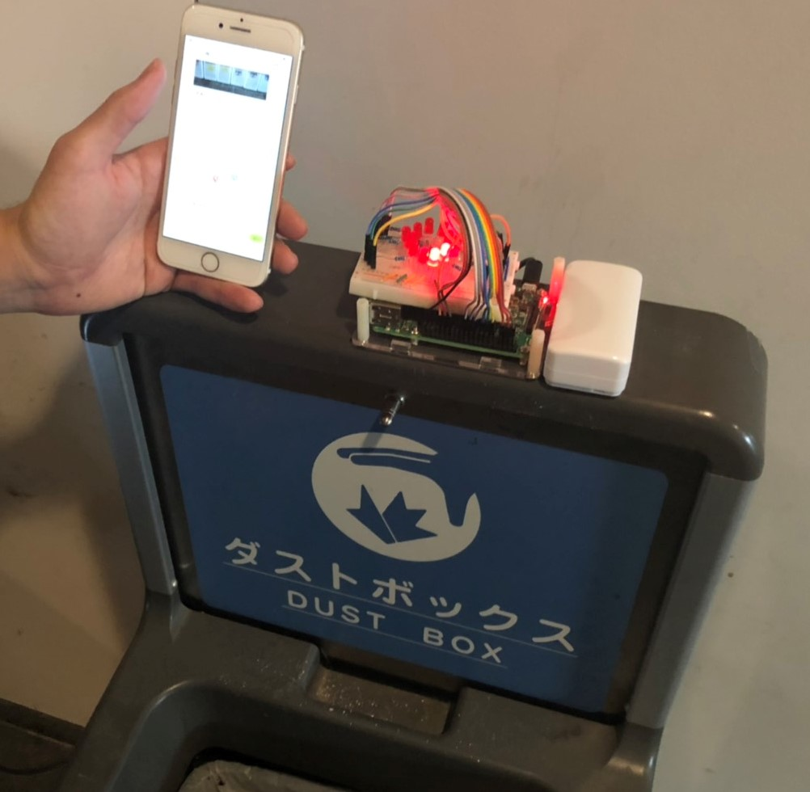

# ごみUp

## 動画

## 製品概要
### ごみ×Tech

### 背景（製品開発のきっかけ、課題等）
「ゴミを捨てたいのに、ゴミ箱がない。仕方ないから、見つからないようにポイ捨てしてしまおう」
我々は、そんな後ろめたくて仕方ない気持ちを持った日本国民を救うために「ごみUp」を開発しました。

ごみUpは、ゴミ箱を見つけるまでの工程をHackすることで、ゴミをゴミ箱に捨てるためのハードルを下げることを目的にしたサービスです。

日本国民のこういった悩みを解決すると同時に、このサービスは日本の景観美化や環境実現まで実現します。また、日本は諸外国に比べてゴミ箱の数が少ないため、東京オリンピックで大量の外国人観光客が来日した際に、ゴミ問題は更に深刻化することが考えられます。そういった問題も解決するのがごみUpです。
### 製品説明（具体的な製品の説明）

ごみUpはゴミ箱に近づくとLINE BOTを通じて、そのことを知らせてくれます。

    

ゴミ箱にはLINE Beaconが設置されており、簡単なIoTデバイスも設置することができます。例えば、ゴミ箱にLEDを設置しておけば、ユーザが近づいたときにLEDを明滅させて、その位置をわかり安く示してくれます。

ゴミをゴミ箱に捨て、その写真をLINE BOTに送ることや、ゴミ箱がいっぱいになったことをLINE BOTを通じて知らせることで、ユーザにポイントが付与されます。ポイントの高いユーザは、ゴミ箱から大きな歓迎を受けるでしょう。

ごみUpはこれらの機能を通じて、ゴミの位置をわかりやすくしてくれるだけでなく、ゴミを捨てることを楽しく演出したり、ゴミ箱が満杯になったことをゴミ箱の管理者に知らせることができるので、ゴミを捨てやすくしてくれるだけでなく、環境保全・景観美化にも貢献します。

### 特長
#### 1. ゴミ箱を捨てるハードルを下げ、楽しくゴミを捨てられるようにする
#### 2. 日本の環境を美化する

### 解決出来ること
#### 1. ゴミを捨てたいのにゴミ箱が見つからなくて捨てられない人の不満
#### 2. ポイ捨て問題

### 今後の展望
- LINE BOT上でアプリを実装したことによって、他のアプリケーションとのシナジーが生まれるのではないか？（例：観光名所を紹介する）
- ゴミをより捨てたくなるような魅力的なゴミ箱を作ること（例：ゴミ箱が「お前の本気を見せてみろよ！」とゴミを捨てるようにあおってくる」）
- 正確なポイント付与をするために、ゴミを捨てたことをセンサーにより検出する

## 開発内容・開発技術
### 活用した技術
#### API・データ
* LINE BOT
* LINE Beacon
* NEC 簡単画像認識API

#### フレームワーク・ライブラリ・モジュール
* NODE.js
* Python
* LINE BOT
* heroku
* now
* Google Map API

#### デバイス
* raspberry pi3
* LINE Beacon
* スマートフォン

### 研究内容・事前開発プロダクト（任意）
なし

### 独自開発技術（Hack Dayで開発したもの）
#### 2日間に開発した独自の機能・技術
アイデアからすべてこの2日間で実装しました。

**特に力を入れた部分**
- LINE Beaconを使って位置情報を取得した
- LINE BOTのインタフェースを使った
- LINEの規約を遵守した（当初想定していたアイデアは規約に反する恐れがあったため、ゴミ箱に捨てました🚮）
- ゴミ箱がいっぱいになったことを検知する機能を実装した
- ユーザポイントを付与する機能を実装した
- ユーザが画像を送信すると、簡単画像認識APIがごみ箱の画像であるかを判定する機構を作った
　　
  　　
    
効果音素材は効果音ラボ様( https://soundeffect-lab.info/ )よりお借りしました。

raspberrypi/wav ディレクトリ内に
- https://soundeffect-lab.info/sound/button/mp3/decision5.mp3
- https://soundeffect-lab.info/sound/anime/mp3/piano1.mp3　　

の2つのファイルをwavに変換し、　　
- raspberrypi/wav/decision5.wav　　
- raspberrypi/wav/piano1.wav　　

としてテスト用に使用しました。

